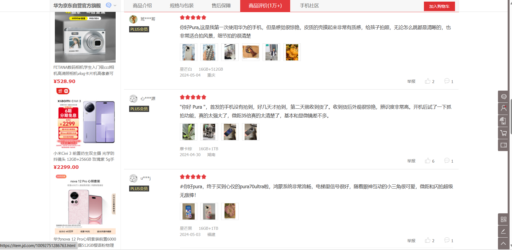
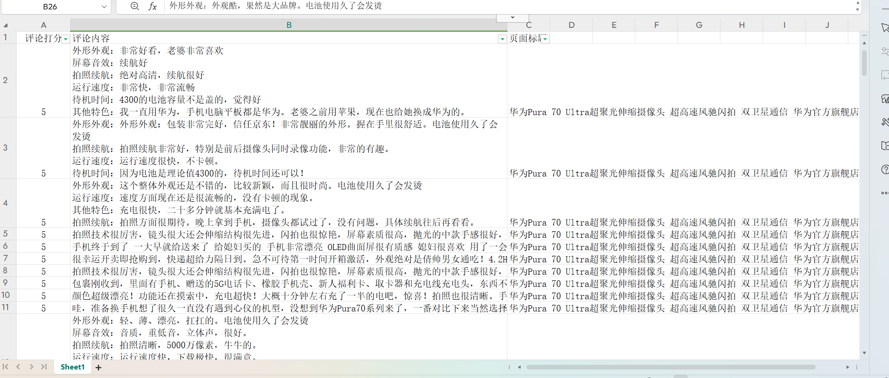
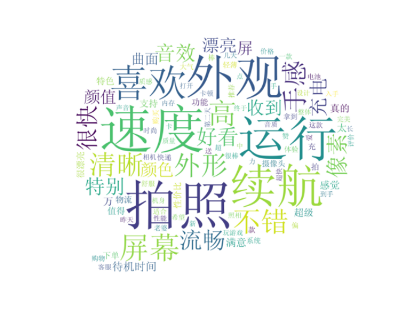
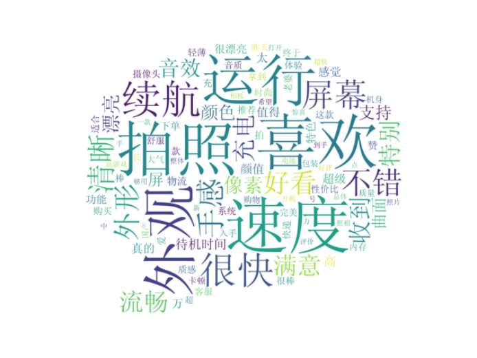
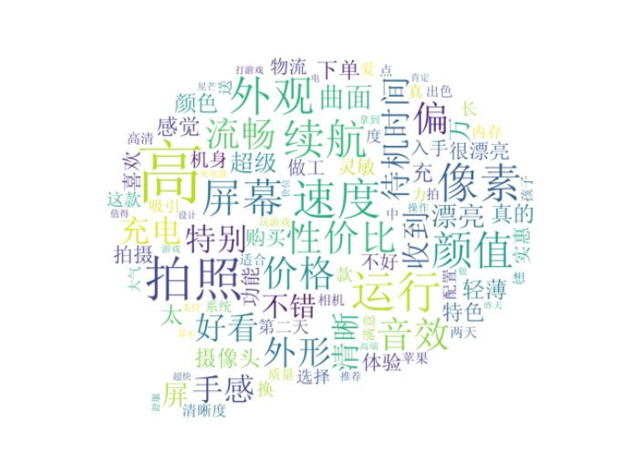
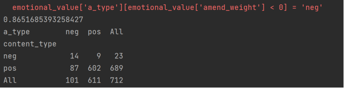
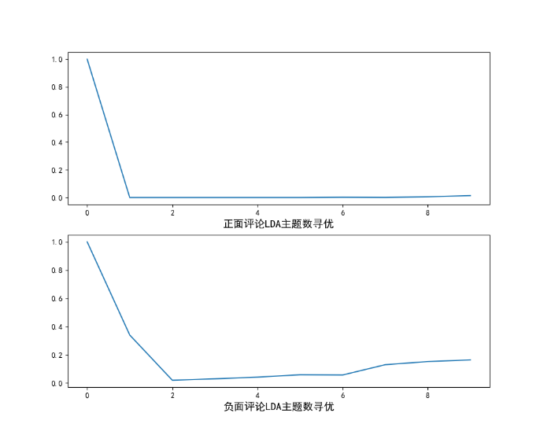

# **如何提高信息检索效率？**


## ——使用机器学习针对大量网络评论高效分析

---

## 前言
随着互联网技术的飞速发展和社交媒体的广泛普及，人们对于信息的需求和获取方式发生了显著变化，逐渐形成了一种主动进行信息检索的行为趋势。特别是在做出决策和评论前，人们倾向于到评论区翻阅他人的评论和反馈获取第一手资料。这种信息检索行为的产生，一方面体现了人们对互联网资源的依赖和信任程度的提高，另一方面也反映了人们对于海量信息的筛选和判断能力的提升。然而，这种信息检索行为也面临着诸多挑战，如重复相似评论过多、评论质量参差不齐，以及用户在面对大量评论时无法快速有效地甄别和提取有用信息等问题，这些挑战不仅影响了用户的决策效率，也可能导致信息过载，使得用户在海量信息中迷失方向，难以捕捉到真正有价值的信息。


*附上手机图片*


为解决这一痛点，我们开发了这个智能化的评论分析程序，利用自然语言处理和倾向分析技术，它可以将海量的网络评论进行分类，并从中提取关键信息。通过这种方式，用户可以更加直观迅速地了解公众对于某个事件或某种产品的聚焦点，节约在繁杂的评论中迷茫的时间。  （本项目以最新款HUAWEI Pura 70 Ultra手机评论区为例进行展示）


---
## 项目流程
在对华为手机Pura 70 Ultra的评论数据进行高效数据分析的过程中，我们将会遵循以下步骤：

1. 首先，我们通过京东平台获取华为手机Pura 70 Ultra的用户评论。并将其做成excel表格的形式进行汇总。

2. 接着，我们会对收集到的评论数据进行过滤、评论拆分、关键词获取等处理操作，以便后续的分析。

3. 然后，我们会对预处理后的评论数据进行词云图的生成，将评论数据根据其表达的不同类别划分为正面评论（即好评）和负面评论（即差评）。

4. 最后，我们会分别对正面和负面的评论数据进行LDA主题分析，以从评论数据中提取出有价值的信息，并从中分析和理解用户的需求、意见、购买原因以及产品的优缺点。

---

## 前期准备工作

由于电商平台商品评论具有复杂性、多样化、大体量、主观态度明确等特点，本项目以最新款HUAWEI Pura 70 Ultra手机评论区为例进行项目展示。



为了构建一个全面且具有代表性的评论数据集，我们采取了一系列严谨的步骤来确保数据的高质量和分析的有效性。我们首先从京东这一知名的电子商务平台中，选取了关于HUAWEI Pura 70 Ultra的最新评论数据。通过利用高效的自动化数据采集工具，结合人工校对的细致审查，成功收集了1135条评论，确保了数据集的完整性和准确性。

(由于爬虫技术有限，评论集获取由人工手动完成 )

尽管我们的初步筛选过程旨在确保数据的质量，但仍不可避免地存在初始数据集中导致不能直接使用的一些问题，例如电商平台会自动为超时未评价的顾客提供默认好评以及购买者可能会完全复制他人的评论等。为了解决这些问题，我们对数据进行了去重复化处理，确保关键词提取的准确性，为后续分析提供坚实的基础。

**由于代码部分使用了一些重要库，所以需要老师配置一下环境才能运行出来~**

库文件安装详见压缩包。
路径：win\venv\Lib\site-packages


---
注：此处项目内容只做简单介绍，详细公式与算法请见项目报告。
## 项目内容

### 一、 数据处理
**1. 数据获取**

本项目的数据获取环节，针对华为 Pura 70 Ultra 智能手机在电商平台上的用户评论进行了系统性的收集与整理。通过细致的数据采集策略和技术手段，对京东平台上的相关评论数据进行了系统性的抽取。准确而高效地获取了一千余条具有代表性的用户评论数据。这些数据作为后续分析和处理的重要基础，为深入挖掘和理解用户反馈提供了坚实的支撑。具体评论内容细节查看，请前往文件“京东华为Pura 70 Ultra最新评论.xlsx”



**2. 数据过滤**

在大多数状况下，不同购买者之间具备价值的评论基本不会出现完全重复的情况，倘若不同购物者的评论呈现完全重复态势，那么这些评论通常都不具实际意义。显然，在此种评论中仅有最早出现的评论具备实际意义。

因此，为了存留更多的有用评论，本过程针对完全重复的语料下手，仅删除完全重复部分，以确保保留有用的文本评论信息。关键代码如下：

``` python
def Data_Cleansing():
    data = pd.read_excel("京东华为Pura 70 Ultra最新评论.xlsx")# 读取评论集Excel文件
    data = data[['评论内容', '评论打分']].drop_duplicates()  # 去重
```
**3. 评论分数转换**

在本项目之中，总计收集了一千余条评论数据。其中，具体涵盖好评、中性评论以及差评这三种类别。我们针对这三个种类的评论各自赋予相应的评分，即 1、3 和 5。为了给后续的关键词分类提供便利，我们对评分进行转换，将评分 1 和 3 转换为 neg，而将评分 5 转换为 pos。关键代码详情如下：

``` python
# 评论分数转换
    data.loc[data['评论打分'] == 1, '评论打分'] = 'neg'
    data.loc[data['评论打分'] == 3, '评论打分'] = 'neg'# 将评论分数为1和3的评论标记为负向评价（neg）
    data.loc[data['评论打分'] == 5, '评论打分'] = 'pos'# 将评论分数为5的评论标记为正向评价（pos）
    print(data.head())
```
**4. 数据清洗**

通过观察收集上来的数据，我们发现，评论中夹杂着许多数字与字母，对于本项目的挖掘目标而言，这类数据本身并没有实质性帮助。另外，由于该评论文本数据主要是围绕华为 Pura 70 Ultra进行评价的，其中“京东”“ 手机”“ 华为”“ 华为Pura”,“华为 Pura 70 Ultra”等词出现的频数很大，但是对分析目标并没有什么作用。如果这些词语保留，那么在获取关键词时，它们的出现频率将会非常高，同时占有很大的比重。这对我们获取真正的关键词是十分不利的。所以，我们在进行评论拆分之前，就将这些词去除，对数据进行清洗，从而保证我们获得到的关键词都是真正有利于我们进行产品分析的。关键代码详情如下：

```python
# 由于评论主要为华为Pura 70 Ultra的评论，因此去除这些词语
    str_tmp = re.compile('[0-9a-zA-Z]|京东|手机|华为|华为Pura|华为Pura 70 Ultra|')  # re模块 正则表达式
    content = content.apply(lambda x: str_tmp.sub('', str(x)))  # 空值替换匹配内容
```
### 二、词云图生成

**1. 评论分析**

首先进行评论拆分，为了提取出关键词，在进行基础的数据过滤操作之后，我们需要将一整句评论拆分成一个个词语，这也是文本信息处理的基础环节。

在本项目中，我们使用具有精确模式、全模式、和搜索引擎模式三种模式的jieba库来实现本项目的评论拆分功能。

```python
# 评论拆分
    word_tmp = lambda s: [(x.word, x.flag) for x in psg.cut(s)]  # 自定义一个简单的拆分函数，将评论内容拆分成词语及其词性
    seg_word = content.apply(word_tmp)
```
接着我们需要去除停用词。本项目的停用词大约分成两大类。

第一类是使用十分广泛，甚至过于频繁的一些词语，如中文的“我”“就”等，这些词几乎在每条评论上都会出现，查询这样的词无法保证搜索引擎能够给出真正相关的搜索结果，因此无法通过缩小搜索范围来提高搜索结果的准确性，同时还会降低搜索的效率。

另一类是评论中出现频率很高，但实际意义不大的词。这一类词主要包括了语气助词、副词、介词、连词等，它们自身通常并无明确意义，只有将其放入一个完整的句子中才有一定作用。常见的有“的”“在”“和”“接着”等。

因此，为获取真正的关键词，实现高效优良的评论分析功能，我们整理了一个停用词表，对评论集进行了去除处理。关键代码如下：

```python
    # 删除停用词
    # 读取停用词文件
    stop_path = open("./data/stoplist.txt", 'r', encoding='UTF-8')
    stop = stop_path.readlines()
    stop = [x.replace('\n', '') for x in stop]
    word = list(set(word) - set(stop))
    result = result[result['word'].isin(word)]
```
**2. 关键词提取**

由于本项目以华为 Pura 70 Ultra的评论区为例进行分析，那么类似于“不错，很好的产品”“很不错，继续支持”等评论虽然表达了对产品的情感倾向，但是实际上无法根据这些评论提取出具体的关键词，比如哪些产品特征是用户满意的，哪些缺点是需要消费者留心的。评论中只有出现明确的名词，如机构团体及其他专有名词时，才有意义。

因此在对评论进行拆分处理后，我们还将词语的词性进行了标注。之后，我们再根据词性，将含有名词类的评论提取出来。关键代码如下：

```python
# 提取含有名词类的评论
    ind = result[['n' in x for x in result['nature']]]['index_content'].unique()
    result = result[[x in ind for x in result['index_content']]]# 初始化一个集合，用于存储含有名词类的评论的id
```

**3. 词云图生成**

**(1) 总体词云图生成**

在数据处理结束后，我们绘制词云来查看评论切分效果，生成的词云会将评论集中出现频率较高的“关键词”予以视觉上的突出。首先我们对词语进行了词频统计，将词频按照降序排序，选择前100个词，使用wordcloud模块中的WordCloud绘制词云，查看切分效果，代码如下：

```python
# 绘制词云

    import matplotlib.pyplot as plt
    from wordcloud import WordCloud

    frequencies = result.groupby(by=['word'])['word'].count()
    frequencies = frequencies.sort_values(ascending=False)# 计算词频
    backgroud_Image = plt.imread('./data/pl.jpg')# 读取背景图片
    # 初始化WordCloud对象
    wordcloud = WordCloud(font_path="simsun.ttf",
                          max_words=100,
                          background_color='white',
                          mask=backgroud_Image)
    my_wordcloud = wordcloud.fit_words(frequencies)# 生成词云
    # 显示词云
    plt.imshow(my_wordcloud)
    plt.axis('off')
    plt.show()
```


*华为 Pura 70 Ultra 评论词云图*



通过上方词云图可以看出，对评论数据进行处理后，切割效果较为符合预期。其中“速度”“外观”“拍照”“运行”“续航”等词出现频率较高，即在HUAWEI Pura 70 Ultra手机评论区中，出现的关键词主要集中在以上词语中，我们在大体上对该评论区成功进行了关键词提取。

**(2) 关键词分类**

根据以上关键词的提取，我们知道了该产品用户关注的关键方面包括哪些。但是在进行数据检索的过程中，用户需要大量了解对于这些关键词的评价是好还是坏，只有了解这些基本信息，才是一次有效的信息检索。因此我们对关键词进行分类和更精准的分析，来提高信息检索的有效性。

```python
# 读入褒贬评价词
    pos_comment = pd.read_csv("./data/好词.txt", header=None, sep="\n",
                              encoding='utf-8', engine='python')
    neg_comment = pd.read_csv("./data/坏词.txt", header=None, sep="\n",
                              encoding='utf-8', engine='python')
    pos_emotion = pd.read_csv("./data/褒义.txt", header=None, sep="\n",
                              encoding='utf-8', engine='python')
    neg_emotion = pd.read_csv("./data/贬义.txt", header=None, sep="\n",
                              encoding='utf-8', engine='python')

    # 合并褒贬词与评价词
    positive = set(pos_comment.iloc[:, 0]) | set(pos_emotion.iloc[:, 0])
    negative = set(neg_comment.iloc[:, 0]) | set(neg_emotion.iloc[:, 0])
    intersection = positive & negative  # 褒贬表中相同的词语
    positive = list(positive - intersection)
    negative = list(negative - intersection)
    positive = pd.DataFrame({"word": positive,
                             "weight": [1] * len(positive)})
    negative = pd.DataFrame({"word": negative,
                             "weight": [-1] * len(negative)})

    posneg = positive.append(negative)
```

在进行关键词分类时，我们意识到，汉语中存在多重否定现象，即当否定词出现奇数次时，表示否定意思；当否定词出现偶数次时，表示肯定意思。那么按照汉语习惯，我们搜索了每个情感词前两个词语，若出现奇数否定词，则调整为相反的属性。接着，读入否定词表，对关键词进行进一步分类。计算每条评论的得分，将评论分为正面评论和负面评论，关键代码如下：

```python
 # 处理否定修饰词
    data_posneg['amend_weight'] = data_posneg['weight']  # 构造经过否定修正后的新列
    data_posneg['id'] = np.arange(0, len(data_posneg))
    only_inclination = data_posneg.dropna()  # 只保留有评价值的词语
    only_inclination.index = np.arange(0, len(only_inclination))
    index = only_inclination['id']

    for i in np.arange(0, len(only_inclination)):
        review = data_posneg[data_posneg['index_content'] ==
                             only_inclination['index_content'][i]]  # 提取第i个关键词所在的评论
        review.index = np.arange(0, len(review))
        affective = only_inclination['index_word'][i]  # 第i个关键值在该文档的位置
        if affective == 1:
            ne = sum([i in notdict['term'] for i in review['word'][affective - 1]])
            if ne == 1:
                data_posneg['amend_weight'][index[i]] = - \
                    data_posneg['weight'][index[i]]
        elif affective > 1:
            ne = sum([i in notdict['term'] for i in review['word'][[affective - 1,
                                                                    affective - 2]]])
            if ne == 1:
                data_posneg['amend_weight'][index[i]] = - \
                    data_posneg['weight'][index[i]]
```

**(3) 褒贬词云图生成**

通过上面对关键词褒贬属性的分类，我们可以将正面评论的关键词和负面评论的关键词分别绘制一个词云图，进而进行更有效的信息检索，让我们知道在大量关键词中，哪些词语是对其正面的评价，哪些是负面的评价。这对于我们对于信息属性的了解尤为重要，我们也可以根据正反属性的分类了解到更准确的信息元素。

我们使用wordcloud包下的WordCloud函数分别对正面评论和负面评论绘制词云，以查看正反关键词分类效果，关键代码如下：

```python
# 绘制词云
    import matplotlib.pyplot as plt
    from wordcloud import WordCloud

    # 正面关键词词云
    freq_pos = posdata.groupby(by=['word'])['word'].count()
    freq_pos = freq_pos.sort_values(ascending=False)
    backgroud_Image = plt.imread('./data/pl.jpg')
    wordcloud = WordCloud(font_path="simsun.ttf",
                          max_words=100,
                          background_color='white',
                          mask=backgroud_Image)
    pos_wordcloud = wordcloud.fit_words(freq_pos)
    plt.imshow(pos_wordcloud)
    plt.axis('off')
    plt.show()
    # 负面关键词词云
    freq_neg = negdata.groupby(by=['word'])['word'].count()
    freq_neg = freq_neg.sort_values(ascending=False)
    neg_wordcloud = wordcloud.fit_words(freq_neg)
    plt.imshow(neg_wordcloud)
    plt.axis('off')
    plt.show()
```

*正面评论词云*


*负面评论词云*


为了更清楚的反映出来我们对关键词分类的准确性，我们还对比了原评论关键词的褒贬属性与我们分析得出的褒贬属性。假定用户在评论时不存在选了好评的标签，而写了差评内容的情况，我们绘制如下测评矩阵：



通过比较原评论关键词的褒贬属性与我们分析得出的褒贬属性，基于词表的关键词分析的准确率达到了86.51%，证明通过词表的关键词分析去判断HUAWEI Pura 70 Ultra手机评论区中是有效的。


### 三、深度分析

在核对产出结果真实性时，我们发现，在HUAWEI Pura 70 Ultra评论中，根据我们之前进行的评论分割的一般规则，经过分割的语句会将“质量”等一类一词单独划分出来。而“质量”是指送货质量还是HUAWEI Pura 70 Ultra的产品质量等其他情况？如果只是简单地统计词语的频数，这是无法识别的。这种指代不明的问题并不能准确地反应出评论关键词的准确情况。所以，在深度分析部分，我们运用LDA主题模型求得词汇在主题中的概率分布，判断“质量”一词属于哪个主题，并求得属于这一主题的概率和同一主题下的其他特征词，从而解决多种指代问题。建立LDA主题模型，首先需要建立词典及语料库，关键代码如下：

```python
# 建立词典
    pos_dict = corpora.Dictionary([[i] for i in posdata['word']])  # 正面
    neg_dict = corpora.Dictionary([[i] for i in negdata['word']])  # 负面

    # 建立语料库
    pos_corpus = [pos_dict.doc2bow(j) for j in [[i] for i in posdata['word']]]  # 正面
    neg_corpus = [neg_dict.doc2bow(j) for j in [[i] for i in negdata['word']]]  # 负面
```
接着，我们开始寻找最优主题数。我们选择了基于相似度的自适应最优LDA模型选择方法，来确定主题数并进行主题分析。资料证明该方法可以在不需要人工调试主题数目的情况下，用相对少的迭代找到最优的主题结构。具体步骤如下：
(i)取初始主题数k值，得到初始模型，计算各主题之间的相似度（平均余弦距离）。

```python
# 构造LDA主题数寻优函数
    def cos(vector1, vector2):  # 余弦相似度函数
        dot_product = 0.0
        normA = 0.0
        normB = 0.0
        for a, b in zip(vector1, vector2):
            dot_product += a * b
            normA += a ** 2
            normB += b ** 2
        if normA == 0.0 or normB == 0.0:
            return (None)
        else:
            return (dot_product / ((normA * normB) ** 0.5))
```

(ii)增加或减少k值，重新训练模型，再次计算各主题之间的相似度。

```python
# 循环生成主题并计算主题间相似度
        for i in np.arange(2, 11):
            lda = models.LdaModel(x_corpus, num_topics=i, id2word=x_dict)  # LDA模型训练
            for j in np.arange(i):
                term = lda.show_topics(num_words=50)
```

(iii)重复步骤2直到得到最优k值。

```python
# 构造主题词列表，行表示主题号，列表示各主题词
            mat = []
            for j in np.arange(i):
                top_w = top_word[j]
                mat.append(tuple([top_w.count(k) for k in unique_word]))

            p = list(itertools.permutations(list(np.arange(i)), 2))
            l = len(p)
            top_similarity = [0]
            for w in np.arange(l):
                vector1 = mat[p[w][0]]
                vector2 = mat[p[w][1]]
                top_similarity.append(cos(vector1, vector2))

            # 计算平均余弦相似度
            mean_similarity.append(sum(top_similarity) / l)
        return (mean_similarity)

    # 计算主题平均余弦相似度
    pos_k = lda_k(pos_corpus, pos_dict)
    neg_k = lda_k(neg_corpus, neg_dict)
```

通过使用LDA主题模型，我们找出了不同主题数下的主题词，每个模型各取出若干个主题词（比如前100个），合并成一个集合。生成任何两个主题间的词频向量，计算两个向量的余弦相似度，值越大就表示越相似；计算各个主题数的平均余弦相似度，寻找最优主题数.

*生成结果*


通过观察上方折线图，我们可以清楚的看到，对于正面评论数据，当主题数为1或2时，主题间的平均余弦相似度就达到了最低。因此，对正面评论数据做LDA，可以选择主题数为2；对于负面评论数据，当主题数为3时，主题间的平均余弦相似度也达到了最低。因此，对负面评论数据做LDA，也可以选择主题数为2。


### 四、实验结果

通过分析图13我们得知，“续航”“速度”“拍照”等词语在正面词云图出现的频数较高。这说明HUAWEI Pura 70 Ultra在续航、芯片、拍照系统等方面收获用户大量好评。并且在正面词云图中，并没有掺杂负面情感词语，这说明我们进行的情感分析能较好地将正面情感评论抽取出来。

通过分析负面情感评论词云，我们发现“待机时间” “价格”等关键词出现的频数较高。这说明HUAWEI Pura 70 Ultra可能存在待机时间短、价格偏高等问题。

根据图20中主题数寻优结果，我们使用Python的Gensim模块对正面评论数据和负面评论数据分别构建LDA主题模型，设置主题数为2，经过LDA主题分析后，每个主题下生成10个最有可能出现的词语以及相应的概率。

|Topic1|Topic2|
|---|---|
|喜欢|很快|
|速度|屏幕|
|拍照|续航|
|运行|满意|
外观|好看
不错|外形
手感|充电
清晰|流畅
特别|屏
收到|音效

上表反映了HUAWEI Pura 70 Ultra正面评价文本中的潜在主题，主题1中的高频特征词，关注点主要是速度、外观、拍照等，主要反映HUAWEI Pura 70 Ultra处理速度快、拍照清晰、外形设计较好等；主题2中的高频特征词，即关注点主要是续航、音效等，主要反映HUAWEI Pura 70 Ultra在续航方面有着较强竞争力等。

|Topic1|Topic2|
|---|---|
|运行|价格|
速度|续航
外观|拍照
价格|流畅
像素|价格
颜值|屏幕
音效|性价比
手感|待机
电池|外观
屏幕|像素

这张表则反映了HUAWEI Pura 70 Ultra负面评价文本中的潜在主题，主题1中的高频特征词主要关注点在运行速度、价格、电池这几方面，说明可能存在价格偏高、电池寿命短、部分手机质检不严格导致的残次品按正品发货等问题；主题2中的高频特征词主要与拍照、屏幕等几方面有关，主要反映该产品HUAWEI Pura 70 Ultra做工可能存在像素与前几款手机相比较低、部分手机屏幕不够灵敏等问题。

## 总结与展望

通过对以上实验结果的分析可知，本项目对 HUAWEI Pura 70 Ultra 产品的评论集进行了深入且全面的分析处理。通过运用智能化的评论分析程序，成功实现了对大量网络评论的精准分类处理，得出产品在不同角度的关键信息。这一成果充分表明，我们所构建的智能化评论分析体系具备卓越的性能和较为强大的功能，能够有效地应对复杂多样的评论数据，在实际应用中较好地达成预期目标，为缓解当今信息检索压力做出自己的贡献。

在未来，我们期望这个智能化评论分析程序能够不断进化和完善。一方面，持续提升对各种复杂语言结构和语义的理解能力，以更加精准地对网络评论进行分类和关键信息提取。另一方面，进一步精细化对关键词的提取，能够更加准确地得出关键信息。我们希望能通过与大数据技术的深度融合，实时跟踪和分析网络舆论动态，为企业和社会提供更具前瞻性和针对性的决策支持。

同时，还希望加强与人工智能其他领域的协同合作，开发出更加智能、高效、个性化的服务功能，以满足不同用户群体针对信息检索地多样化和精细化需求。相信在不久的将来，我们的项目将在信息分析领域发挥更大的价值，为推动互联网信息利用的智能化发展贡献重要力量。

